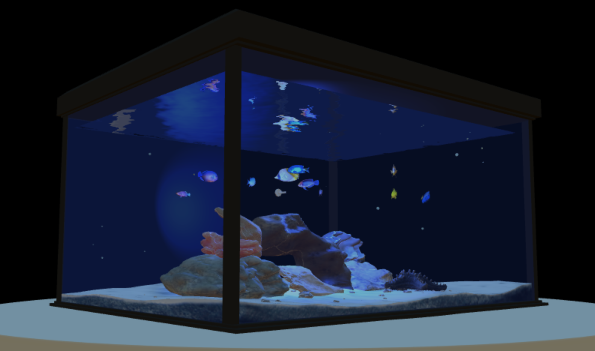

# Computer Graphics
Gachon University 2020 Fall semester

### Title: Aquarium

##### ~~Demo: [URL](https://fish.chlee1001.synology.me/) (Using node.js)~~Server is down

* Introduction : 2020 Fall semester Final Project
* Concept : Raising Fishbowl
* Member : Park Seong Won, Lee Kang Uk, Lee Chae Hyeon
* Task : Using Three.js, implement WEB fishbowl

### Tchonology Used
> Docker

> Node.js - Express

> Three.js

### Preview
#### Demo Video: [Link](https://youtu.be/Goi1VeH1tBU)

### Presentaion
* Proposal Presentaion(2020.10.26): [[PDF](https://drive.google.com/file/d/1y6ClEMaePt1-3HsKvs2-RZpnNRtiyNYq/view?usp=sharing)] Topic selection and Scheduling
* Final Presentation(2020.11.30): [[PPTX](https://drive.google.com/file/d/1B5cfIglWJ0vnz-ImvmTYNYo9U-QsLmeQ/view?usp=sharing)] Implementation details and performance

